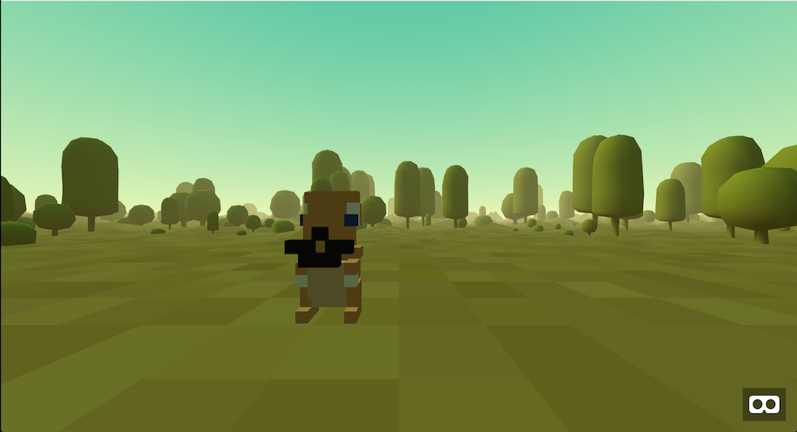

# Derpymon Go

Catch derpy monsters in VR

NOTE: This does not currently work without a modified version of Maquette

## Quickstart

* npm i
* dojo build --watch
* npm run serve
* http://localhost:8888

## Debugging

Debugging for DayDream can be done using 
[Chrome Devtool's remove debugging](https://developers.google.com/web/tools/chrome-devtools/remote-debugging/).

Sometimes the DayDream controller is not correctly detected. It can help to turn on the controller and using 
VR a bit before debugging if you experience these issues.

1. Install Chrome Beta on a DayDream phone
1. Build and serve Derpymon
1. Connect your phone using a USB cable and set up debugging 
1. Run Derpymon using the HTTPS server
1. Touch EnterVR and wait
1. Wait. **Do not put your phone in the DayDream headset** Chrome Beta will switch into DayDream mode.
1. Open _Remote Devices_ in Chrome debug tools, connect to your phone, and inspect the Derpymon page.
 

